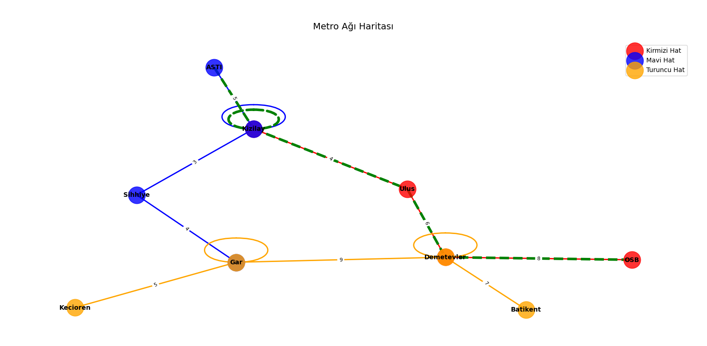

# Metro Ağı Yol Bulma Sistemi

Bu proje, bir metro ağında iki istasyon arasındaki en hızlı rotayı ve en az aktarmalı rotayı bulan bir Python uygulamasıdır. BFS (Breadth-First Search) ve A* algoritmaları kullanılarak metro istasyonları arasındaki bağlantılar modellenmiş ve rotalar hesaplanmıştır.

---

## Kullanılan Teknolojiler ve Kütüphaneler

- **Python 3.x**: Projenin ana programlama dili.
- **`collections.defaultdict`**: Hatlara göre istasyonları gruplamak için kullanılan bir veri yapısı. Varsayılan olarak boş liste döndürerek kodun daha temiz olmasını sağlar.
- **`collections.deque`**: BFS algoritmasında kuyruk (queue) yapısı olarak kullanılır. O(1) karmaşıklığında ekleme ve çıkarma işlemleri sunar.
- **`heapq`**: A* algoritması için öncelik kuyruğu (priority queue) oluşturmak amacıyla kullanılır. En düşük maliyetli rotayı hızlıca seçmeyi sağlar.
- **`typing`**: Kodun okunabilirliğini ve tip güvenliğini artırmak için kullanılan tip anotasyonları (örneğin `List`, `Dict`, `Optional`).

---

## Algoritmaların Çalışma Mantığı

### BFS (Breadth-First Search) Algoritması
- **Nasıl Çalışır?**: 
  - BFS, bir kuyruk yapısı (`deque`) kullanarak başlangıç istasyonundan hedef istasyona kadar tüm olası yolları katman katman (genişlik öncelikli) keşfeder.
  - Her istasyonun komşularını sırayla ziyaret eder ve hedefe ulaşıldığında en az aktarma gerektiren rotayı döndürür.
- **Neden Kullanıldı?**: 
  - Metro ağında aktarma sayısını en aza indirmek için idealdir, çünkü BFS her zaman en kısa yol uzunluğunu (aktarma sayısını) bulur.

### A* Algoritması
- **Nasıl Çalışır?**: 
  - A*, bir öncelik kuyruğu (`heapq`) kullanarak toplam süreyi (maliyeti) minimize eden rotayı bulur.
  - Her adımda mevcut istasyondan komşularına olan maliyeti hesaplar ve en düşük toplam süreye sahip rotayı seçer.
  - Bu projede heuristik fonksiyon kullanılmamıştır; yalnızca gerçek süre (maliyet) dikkate alınmıştır.
- **Neden Kullanıldı?**: 
  - En hızlı rotayı bulmak için optimize edilmiştir. Metro ağında zaman kritik bir faktör olduğundan, A* bu ihtiyacı karşılar.

### Algoritma Seçiminin Nedeni
- **BFS**: Aktarma sayısını minimize etmek için tercih edildi, çünkü genişlik öncelikli arama en az adımda hedefe ulaşır.
- **A***: Zamanı minimize etmek için kullanıldı. Öncelik kuyruğu sayesinde gereksiz yolların aranmasını önler ve performansı artırır.

---

## Örnek Kullanım ve Test Sonuçları

### Kurulum
1. Python 3.x yüklü olduğundan emin olun.
2. Kodu bir `.py` dosyasına kaydedin ve çalıştırın:
   ```bash
   python metro_agi.py
   ```

### Kodun Kullanımı
Metro ağı oluşturulduktan sonra iki temel fonksiyon kullanılabilir:
- `en_az_aktarma_bul(baslangic_id, hedef_id)`: En az aktarmalı rotayı bulur.
- `en_hizli_rota_bul(baslangic_id, hedef_id)`: En kısa süreli rotayı bulur.

### Test Senaryoları ve Sonuçlar
Aşağıdaki testler, örnek metro ağı üzerinde çalıştırılmıştır:

1. **AŞTİ'den OSB'ye:**
   - **En Az Aktarmalı Rota**: AŞTİ -> Kızılay -> Ulus -> Demetevler -> OSB
   - **En Hızlı Rota (22 dakika)**: AŞTİ -> Kızılay -> Ulus -> Demetevler -> OSB

2. **Batıkent'ten Keçiören'e:**
   - **En Az Aktarmalı Rota**: Batıkent -> Demetevler -> Gar -> Keçiören
   - **En Hızlı Rota (21 dakika)**: Batıkent -> Demetevler -> Gar -> Keçiören

3. **Keçiören'den AŞTİ'ye:**
   - **En Az Aktarmalı Rota**: Keçiören -> Gar -> Sihhiye -> Kızılay -> AŞTİ
   - **En Hızlı Rota (16 dakika)**: Keçiören -> Gar -> Sihhiye -> Kızılay -> AŞTİ

---
### Metro Ağı Görselleştirme
Metro ağının grafiksel bir şekilde görselleştirilmiş hali aşağıda gösterilmiştir:



Bu harita, metro ağındaki istasyonları ve hatları göstermektedir. Kırmızı, mavi ve turuncu hatlar farklı renklerle belirtilmiştir. Yeşil kesikli çizgi, AŞTİ'den OSB'ye en hızlı rotayı temsil eder.

## Projeyi Geliştirme Fikirleri

1. **Heuristik Eklenmesi**: A* algoritmasına mesafe veya coğrafi konuma dayalı bir heuristik fonksiyon eklenerek performans artırılabilir.
2. **Gerçek Dünya Verileri**: Gerçek bir şehrin metro ağı verileri entegre edilerek uygulama pratik hale getirilebilir.
3. **Kullanıcı Arayüzü**: Bir GUI (örneğin Tkinter veya Flask ile) eklenerek kullanıcı dostu bir deneyim sunulabilir.
4. **Aktarma Süreleri**: Aktarma noktalarında geçen süreler (örneğin yürüyüş mesafesi) modele dahil edilebilir.
5. **Çoklu Kriter Optimizasyonu**: Hem zaman hem de aktarma sayısını dikkate alan hibrit bir algoritma geliştirilebilir.
